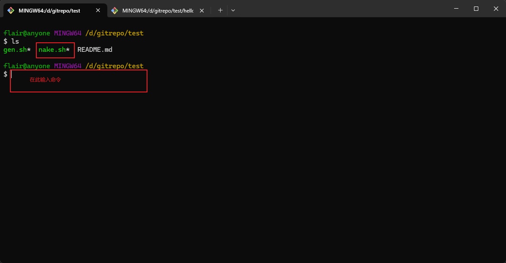
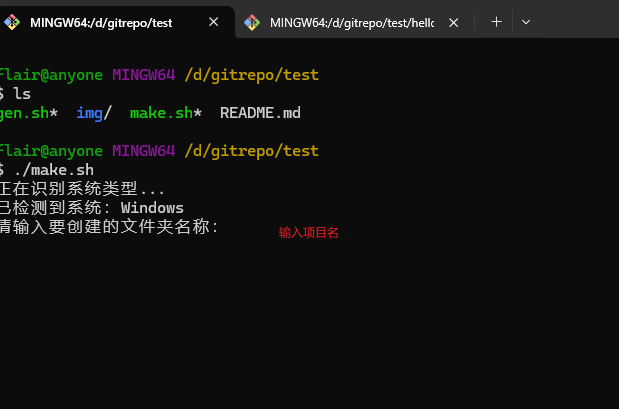
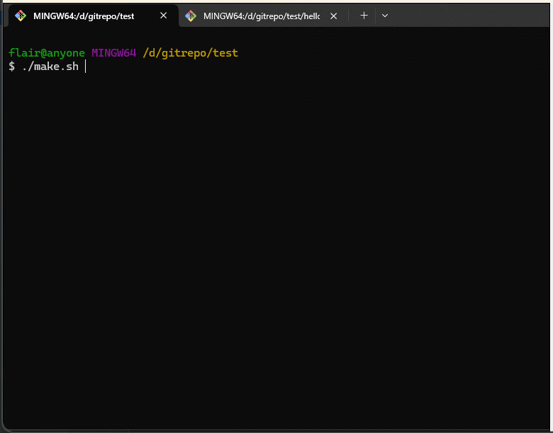
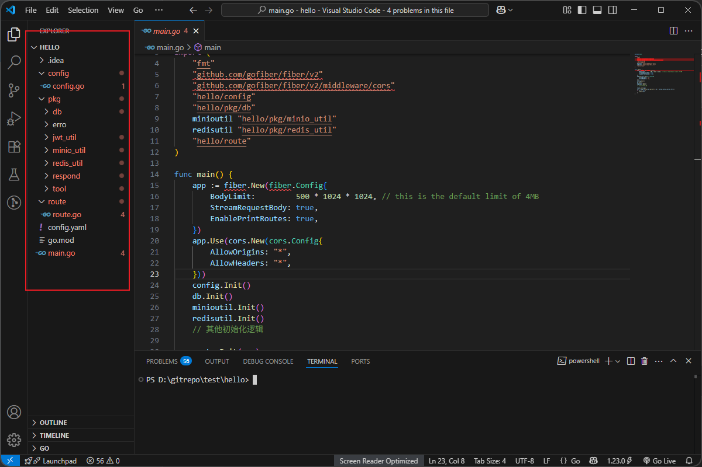
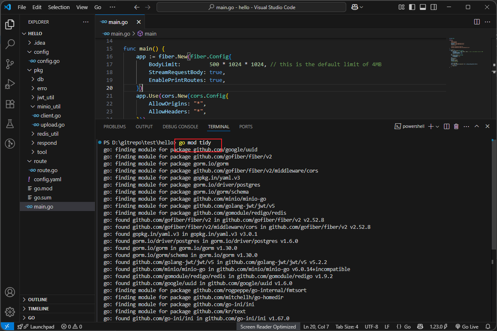
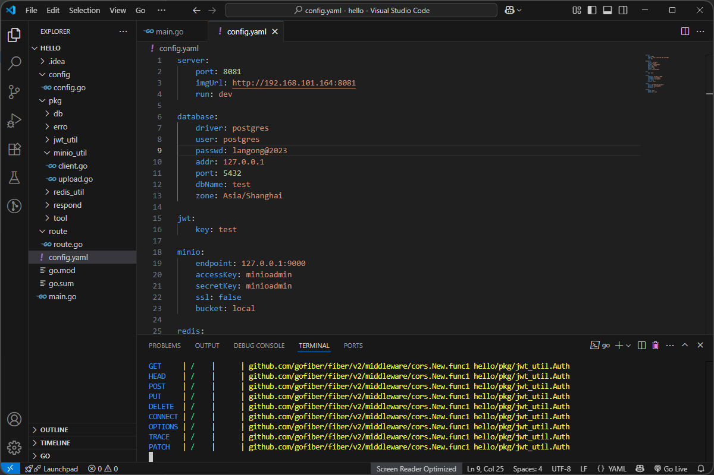
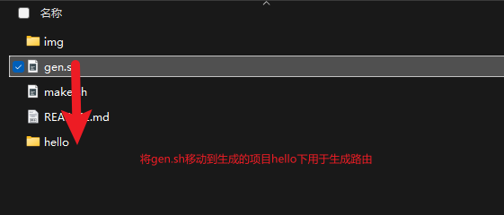
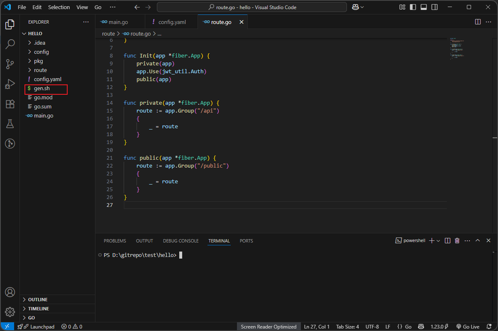
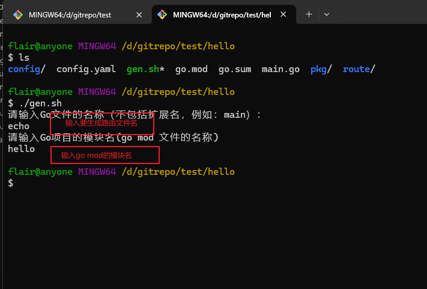
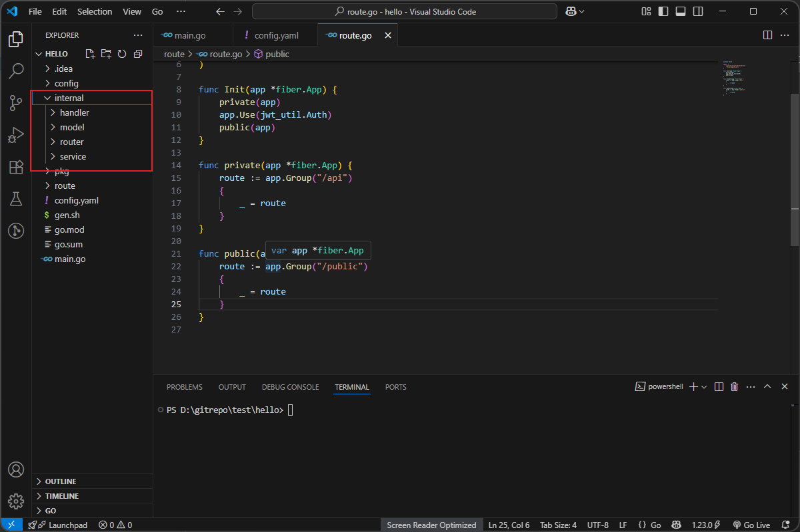

## 生成式命令使用教程

## 项目架构命令

`make.sh`

+ 使用bash终端调用命令，windows上可以使用git bash

+ 运行`make.sh`

此时已经生成了一个项目了。

+ 初始化项目

使用 `go mod tidy`下载依赖。

> window环境下config.go的路径需要改为\ \ 。

+ 启动项目

配置config.yaml的postgres，redis，minio就可以跑起来了，如果没有使用这些插件可以修改一下代码。

## 路由生成

`gen.sh`

项目的架构已经基本生成了，接下来生成路由。将`gen.sh`迁移到生成的项目下。

使用该名称时需要两次输入名称，第一次输入要生成的路由文件名，第二次输入模块名。就会生成如下的`internal`的文件包含四个目录（作用后续再介绍）。

`handler`是路由接受层；

`model`是参数层；

`router`是路由层；

`service`是业务层；

生成之后在service中写逻辑，然后将`internal/router`的方法添加到`route`的`public`或者`private`的方法中就实现了完成的web处理逻辑了。

